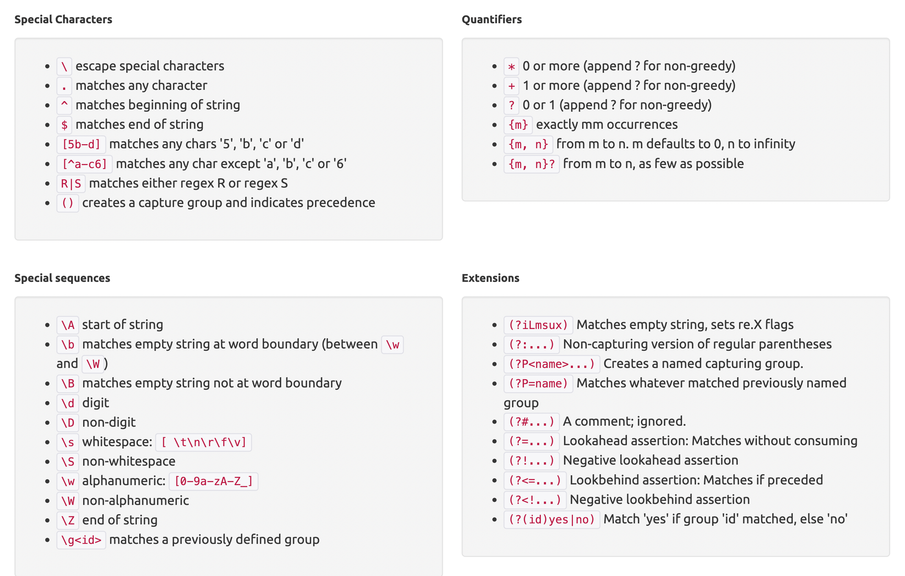

# Python-Regex

Learn Regex in the easy way

`Meta character`      |      `Description`

- `.`        - Any Character Except New Line
- `\d`      - Digit (0-9)
- `\D`      - Not a Digit (0-9)
- `\w`      - Word Character (a-z, A-Z, 0-9, _)
- `\W`      - Not a Word Character
- `\s`      - Whitespace (space, tab, newline)
- `\S`      - Not Whitespace (space, tab, newline)

- `\b`      - Word Boundary
- `\B`      - Not a Word Boundary
- `^`        - Beginning of a String
- `$`        - End of a String

- `[]`      - Matches Characters in brackets
- `[^ ]`  - Matches Characters NOT in brackets
- `|`         - Either Or
- `\`         - Escapes the next character. This allows you to match reserved characters <code>[ ] ( ) { } . * + ? ^ $ \ &#124;</code>
- `( )`     - Group

Quantifiers:
- `*`           - 0 or More
- `+`           - 1 or More
- `?`           - 0 or One
- `{3}`      - Exact Number
- `{3,4}`  - Range of Numbers (Minimum, Maximum)

